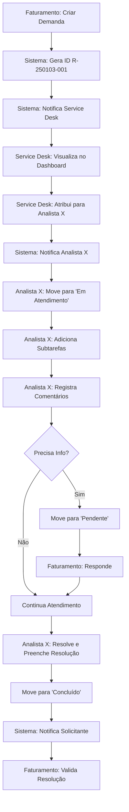

# 📋 N2 Service Desk - Sistema de Gestão de Demandas

> **Sistema profissional de gerenciamento de solicitações de suporte técnico**  
> Desenvolvido por **Matheus Fernandes**

---

## 🎯 Visão Executiva

O **N2 Service Desk** é uma solução completa e moderna que **digitaliza e profissionaliza** o processo de atendimento de demandas de reconexão PrintWayy. O sistema **substitui o processo informal via WhatsApp** por uma plataforma estruturada, rastreável e auditável.

### 📊 Impacto

| Antes (WhatsApp) | Depois (N2 Service Desk) |
|------------------|--------------------------|
| ❌ Sem rastreabilidade | ✅ Histórico completo auditável |
| ❌ Demandas perdidas | ✅ 100% das demandas registradas |
| ❌ Sem métricas | ✅ Dashboard com indicadores (SLA, tempo médio, etc) |
| ❌ Dificuldade de priorização | ✅ Sistema de prioridades (Normal/Urgente) |
| ❌ Sem controle de SLA | ✅ SLA automatizado com alertas |
| ❌ Comunicação fragmentada | ✅ Comentários centralizados por demanda |

---

## 🏗️ Arquitetura do Sistema

```
┌─────────────────────────────────────────────────────────┐
│                   FRONTEND (React)                       │
│  • Interface responsiva e moderna                        │
│  • Atualização em tempo real                            │
│  • Notificações push                                     │
└─────────────────┬───────────────────────────────────────┘
                  │ API REST + WebSockets
┌─────────────────▼───────────────────────────────────────┐
│              BACKEND                     │
│  • Autenticação e controle de acesso                    │
│  • Lógica de negócio (SLA, notificações)               │
│  • Storage de arquivos                                   │
└─────────────────┬───────────────────────────────────────┘
                  │ SQL
┌─────────────────▼───────────────────────────────────────┐
│           BANCO DE DADOS (PostgreSQL)                    │
│  • 11 tabelas relacionais                               │
│  • RLS (Row Level Security)                             │
│  • Triggers e functions automatizadas                    │
└─────────────────────────────────────────────────────────┘
```

---

## 👥 Perfis de Usuário

### 1️⃣ **Perfil Faturamento**
**Responsabilidades:**
- ✅ Criar novas demandas de reconexão
- ✅ Acompanhar status das próprias demandas
- ✅ Adicionar comentários e informações complementares
- ✅ Visualizar histórico de atendimento
- ✅ Receber notificações de conclusão

### 2️⃣ **Perfil Service Desk (N2)**
**Responsabilidades:**
- ✅ Visualizar todas as demandas do sistema
- ✅ Atribuir demandas para si ou outros analistas
- ✅ Alterar status (Aberto → Em Atendimento → Pendente → Concluído)
- ✅ Gerenciar subtarefas dentro das demandas
- ✅ Registrar resolução obrigatória ao concluir
- ✅ Configurar regras de SLA e horários comerciais
- ✅ Gerenciar usuários e permissões
- ✅ Acessar relatórios e analytics completos

---

## ⚙️ Funcionalidades Principais

### 📌 1. Dashboard Kanban Interativo

**Visualização em 4 Colunas:**
```
┌──────────┐  ┌──────────────┐  ┌──────────┐  ┌──────────┐
│  ABERTO  │→ │ EM ATENDIMENTO│→ │ PENDENTE │→ │CONCLUÍDO │
└──────────┘  └──────────────┘  └──────────┘  └──────────┘
```

**Recursos:**
- 🎨 Drag-and-drop para mover demandas (Service Desk)
- 🔴 Destaque visual para demandas urgentes
- ⏰ Indicador de SLA (tempo restante/violado)
- 🔄 Atualização automática em tempo real
- 📊 Contador de demandas por coluna

---

### 🆔 2. Sistema de Identificação Único

**Formato:** `R-YYMMDD-XXX`

**Exemplo:** `R-250103-001` (primeira demanda de 03/01/2025)

**Benefícios:**
- ✅ Geração automática e sequencial
- ✅ Fácil referência em conversas
- ✅ Rastreamento simplificado
- ✅ Integração com outros sistemas

---

### ⏱️ 3. Gestão de SLA Automatizada

**Como Funciona:**
1. **Regras configuráveis** por prioridade (Normal: 8h, Urgente: 4h)
2. **Contabilização inteligente** apenas em horário comercial
3. **Respeita** feriados cadastrados e dias não úteis
4. **Alertas automáticos** quando SLA está próximo de vencer (2h)
5. **Indicadores visuais** nas demandas (verde/amarelo/vermelho)

**Cálculo Preciso:**
```
Tempo Total = Tempo em "Aberto" + Tempo em "Em Atendimento"
(Exclui automaticamente: fins de semana, feriados, fora do horário)
```

---

### 📊 4. Relatórios e Analytics

**Métricas Disponíveis:**
- 📈 Total de demandas por período
- ⏰ Tempo médio de resolução
- 🎯 Taxa de cumprimento de SLA
- 👤 Performance por analista
- 📊 Distribuição por prioridade/status
- 📉 Tendência de demandas ao longo do tempo

**Visualizações:**
- Gráficos de linha (tendências)
- Gráficos de barra (comparações)
- Gráficos de pizza (distribuições)
- Tabelas exportáveis (Excel)

---

### 💬 5. Sistema de Comunicação Interno

**Comentários:**
- 💬 Thread de comentários por demanda
- 👤 Identificação do autor e timestamp
- 🔔 Notificações automáticas para envolvidos
- 📝 Histórico permanente de comunicações

**Histórico de Alterações:**
- 📜 Registro automático de TODAS as mudanças
- 🔍 Rastreabilidade completa (quem/quando/o quê)
- 📊 Auditoria facilitada

---

### ✅ 6. Gestão de Subtarefas

**Funcionalidade:**
- ➕ Criar checklist de tarefas dentro de cada demanda
- ☑️ Marcar subtarefas como concluídas
- 📋 Organização por ordem (arrastar para reordenar)
- 👤 Registro de quem completou cada subtarefa

**Exemplo de Uso:**
```
Demanda: Reconexão PrintWayy Cliente XYZ
  ☑️ Verificar status do serviço
  ☑️ Reiniciar impressoras
  ☐ Testar impressão de documento
  ☐ Confirmar com cliente
```

---

### 🔔 7. Sistema de Notificações

**Eventos que Geram Notificações:**
- 🆕 Nova demanda criada
- 👤 Demanda atribuída a você
- 💬 Novo comentário adicionado
- ✅ Demanda concluída
- ⚠️ SLA próximo de vencer (alerta crítico)
- 🔄 Mudança de status/prioridade

**Canais:**
- 🔔 Notificações in-app (sino no header)
- 📧 E-mail (configurável por tipo de evento)

---

## 🗄️ Estrutura do Banco de Dados

### 📋 Tabelas Principais (11)

#### 1️⃣ **profiles** - Perfis de Usuário
```sql
• id (UUID) - Chave primária vinculada ao auth.users
• full_name (TEXT) - Nome completo
• role (ENUM) - 'faturamento' ou 'service_desk'
• created_at (TIMESTAMP) - Data de cadastro
```

#### 2️⃣ **demands** - Demandas Principais
```sql
• id (UUID) - Chave primária
• demand_id (TEXT) - ID formatado (R-YYMMDD-XXX)
• requester_id (UUID) - Quem criou (FK → profiles)
• assigned_to (UUID) - Responsável atual (FK → profiles)
• status (ENUM) - 'aberto', 'em_atendimento', 'pendente', 'concluído'
• priority (ENUM) - 'normal', 'urgente'
• client_name (TEXT) - Nome do cliente
• document_number (TEXT) - Documento/NF
• main_action (TEXT) - Ação principal
• observations (TEXT) - Observações
• resolution (TEXT) - Resolução (obrigatória ao concluir)
• attachments (TEXT[]) - URLs de arquivos anexados
• sla_violado (BOOLEAN) - Flag de SLA violado
• tempo_acumulado_minutos (INTEGER) - Tempo total decorrido
• ultima_mudanca_status (TIMESTAMP) - Controle de SLA
• created_at, completed_at (TIMESTAMP)
```

#### 3️⃣ **demand_comments** - Comentários
```sql
• id (UUID) - Chave primária
• demand_id (UUID) - FK → demands
• user_id (UUID) - FK → profiles
• comment (TEXT) - Conteúdo do comentário
• created_at, updated_at (TIMESTAMP)
```

#### 4️⃣ **demand_history** - Histórico de Alterações
```sql
• id (UUID) - Chave primária
• demand_id (UUID) - FK → demands
• user_id (UUID) - FK → profiles
• action (TEXT) - Descrição da ação
• details (TEXT) - Detalhes adicionais
• field_name (TEXT) - Campo alterado
• old_value, new_value (TEXT) - Valores antes/depois
• created_at (TIMESTAMP)
```

#### 5️⃣ **demand_subtasks** - Subtarefas
```sql
• id (UUID) - Chave primária
• demand_id (UUID) - FK → demands
• title (TEXT) - Título da subtarefa
• description (TEXT) - Descrição opcional
• completed (BOOLEAN) - Status de conclusão
• order_index (INTEGER) - Ordem de exibição
• created_by (UUID) - FK → profiles
• completed_by (UUID) - Quem completou
• completed_at (TIMESTAMP)
```

#### 6️⃣ **sla_regras** - Regras de SLA
```sql
• id (UUID) - Chave primária
• prioridade (ENUM) - 'normal', 'urgente'
• tempo_limite_horas (INTEGER) - Limite em horas
• created_at, updated_at (TIMESTAMP)
```

#### 7️⃣ **business_hours_config** - Horário Comercial
```sql
• id (UUID) - Chave primária
• start_time, end_time (TIME) - Horário de início/fim
• monday, tuesday, ..., sunday (BOOLEAN) - Dias úteis
• created_at, updated_at (TIMESTAMP)
```

#### 8️⃣ **holidays** - Feriados
```sql
• id (UUID) - Chave primária
• name (TEXT) - Nome do feriado
• date (DATE) - Data
• recurring (BOOLEAN) - Se repete anualmente
• description (TEXT)
```

#### 9️⃣ **notificacoes** - Notificações
```sql
• id (UUID) - Chave primária
• usuario_destino_id (UUID) - FK → profiles
• demanda_id (UUID) - FK → demands
• tipo (ENUM) - Tipo de notificação
• titulo, mensagem (TEXT)
• link_destino (TEXT) - URL de destino
• lida (BOOLEAN) - Status de leitura
• criada_em, lida_em (TIMESTAMP)
```

#### 🔟 **notification_settings** - Configurações de Notificação
```sql
• id (UUID) - Chave primária
• email_on_demand_created (BOOLEAN)
• email_on_demand_assigned (BOOLEAN)
• email_on_demand_completed (BOOLEAN)
• email_on_comment_added (BOOLEAN)
• email_on_sla_warning (BOOLEAN)
• sla_warning_threshold_minutes (INTEGER)
```

#### 1️⃣1️⃣ **demand_analytics** - View de Analytics
```sql
VIEW com dados agregados:
• ID e dados básicos da demanda
• Nomes de solicitante e responsável
• Cálculos de tempo (total_hours, elapsed_hours)
• Flags de SLA
```

---

### 🔐 Segurança (Row Level Security - RLS)

**Políticas Implementadas:**

✅ **Faturamento pode:**
- Criar demandas
- Ver apenas suas próprias demandas
- Atualizar/deletar suas próprias demandas
- Comentar em suas demandas

✅ **Service Desk pode:**
- Ver TODAS as demandas
- Atualizar qualquer demanda (status, atribuição, etc)
- Gerenciar subtarefas
- Configurar SLA, horários, feriados
- Gerenciar usuários

---

### ⚡ Automações (Triggers & Functions)

**1. Geração Automática de ID**
```sql
Trigger: set_demand_id()
Quando: Antes de INSERT em demands
Ação: Gera demand_id no formato R-YYMMDD-XXX
```

**2. Registro de Histórico**
```sql
Trigger: log_demand_change_detailed()
Quando: Após UPDATE em demands
Ação: Registra TODAS as alterações em demand_history
```

**3. Notificações Automáticas**
```sql
Triggers:
• notificar_nova_demanda() - Notifica Service Desk
• notificar_atribuicao() - Notifica responsável
• notificar_conclusao() - Notifica solicitante
• notificar_novo_comentario() - Notifica envolvidos
```

**4. Cálculo de SLA**
```sql
Function: calcular_tempo_restante_sla(demand_id)
Retorna: JSON com tempo decorrido, restante, flags de alerta
Considera: Horário comercial, feriados, fins de semana
```

**5. Controle de Tempo**
```sql
Trigger: atualizar_tempo_sla()
Quando: UPDATE de status
Ação: Acumula tempo decorrido, atualiza timestamps
```

---

## 🛠️ Stack Tecnológica

### **Frontend**
| Tecnologia | Versão | Propósito |
|------------|--------|-----------|
| React | 18.3.1 | Framework UI |
| TypeScript | 5.x | Tipagem estática |
| Vite | 5.x | Build tool |
| Tailwind CSS | 3.x | Estilização |
| shadcn/ui | Latest | Componentes UI |
| @hello-pangea/dnd | 18.0.1 | Drag-and-drop |
| React Router | 6.30.1 | Navegação |
| React Query | 5.83.0 | Gerenciamento de estado |
| date-fns | 3.6.0 | Manipulação de datas |
| Recharts | 2.15.4 | Gráficos e visualizações |
| Sonner | 1.7.4 | Toast notifications |

### **Backend**
| Tecnologia | Propósito |
|------------|-----------| 
| *Backend completo* |
| PostgreSQL 15 | Banco de dados |
| PostgREST | API REST automática |
| Realtime Server | WebSockets |
| Auth Server | Autenticação JWT |
| Storage | Armazenamento de arquivos |

### **Edge Functions**
```typescript
• reset-user-password - Reset de senha administrativo
• send-notification-email - Envio de e-mails via Resend
```

---

## 📁 Estrutura de Arquivos

```
n2-service-desk/
│
├── src/
│   ├── components/               # Componentes React
│   │   ├── ui/                  # Componentes base (shadcn)
│   │   │   ├── button.tsx
│   │   │   ├── card.tsx
│   │   │   ├── dialog.tsx
│   │   │   └── ... (30+ componentes)
│   │   │
│   │   ├── DemandBoard.tsx      # Quadro Kanban principal
│   │   ├── DemandCard.tsx       # Card individual de demanda
│   │   ├── DemandDetailsDialog.tsx
│   │   ├── DemandEditDialog.tsx
│   │   ├── CreateDemandDialog.tsx
│   │   ├── DemandComments.tsx
│   │   ├── DemandSubtasks.tsx
│   │   ├── DemandHistoryTimeline.tsx
│   │   ├── NotificationBell.tsx
│   │   ├── NotificationPanel.tsx
│   │   ├── ReportsAnalytics.tsx
│   │   ├── UserManagement.tsx
│   │   ├── BusinessHoursConfig.tsx
│   │   ├── SLARulesConfig.tsx
│   │   ├── HolidaysConfig.tsx
│   │   └── NotificationSettingsConfig.tsx
│   │
│   ├── pages/                   # Páginas principais
│   │   ├── Auth.tsx            # Login/Cadastro
│   │   ├── Dashboard.tsx        # Dashboard principal
│   │   ├── Settings.tsx         # Configurações
│   │   ├── Reports.tsx          # Relatórios
│   │   ├── CompletedTasks.tsx   # Histórico de concluídas
│   │   ├── ForgotPassword.tsx
│   │   ├── ResetPassword.tsx
│   │   └── NotFound.tsx
│   │
│   ├── hooks/                   # Custom React Hooks
│   │   ├── useAuth.tsx         # Autenticação
│   │   ├── useSLA.tsx          # Cálculos de SLA
│   │   ├── useBusinessHours.tsx
│   │   ├── useNotifications.tsx
│   │   └── use-toast.ts
│   │
│   ├── integrations/
│   │   └── supabase/
│   │       ├── client.ts       # Cliente Supabase (auto-gerado)
│   │       └── types.ts        # Tipos TypeScript (auto-gerado)
│   │
│   ├── lib/
│   │   └── utils.ts            # Utilitários
│   │
│   ├── index.css               # Estilos globais + design tokens
│   ├── App.tsx                 # Componente raiz
│   └── main.tsx                # Entry point
│
├── supabase/
│   ├── config.toml             # Configuração Supabase
│   ├── migrations/             # Migrações SQL (auto-geradas)
│   └── functions/              # Edge Functions
│       ├── reset-user-password/
│       └── send-notification-email/
│
├── public/
│   └── robots.txt
│
├── .env                        # Variáveis de ambiente (auto-gerado)
├── tailwind.config.ts          # Config Tailwind
├── vite.config.ts              # Config Vite
├── tsconfig.json               # Config TypeScript
├── package.json                # Dependências
└── README.md                   # Este arquivo
```

---

## 🚀 Fluxo de Trabalho Típico

### **Cenário: Nova Demanda de Reconexão**



---

## 📈 Benefícios Mensuráveis

### **Operacionais**
- ✅ **100% de rastreabilidade** - Nenhuma demanda perdida
- ✅ **Redução de 80% no tempo de busca** de informações históricas
- ✅ **Automatização de 90% das notificações** (antes manuais)
- ✅ **SLA visível em tempo real** para gestão proativa

### **Estratégicos**
- 📊 **Dados para tomada de decisão** (tendências, gargalos)
- 🎯 **Melhoria contínua** baseada em métricas reais
- 🔍 **Auditoria completa** para conformidade
- 📉 **Redução de retrabalho** por clareza nas comunicações

### **Experiência do Usuário**
- ⚡ **Interface moderna e intuitiva**
- 📱 **Responsivo** (desktop, tablet, mobile)
- 🔔 **Notificações proativas**
- 🎨 **Visual limpo e profissional**

---

## 🔒 Segurança e Conformidade

### **Autenticação**
- 🔐 JWT Tokens com renovação automática
- 🔑 Controle de sessão persistente
- 🚪 Logout seguro com limpeza completa

### **Autorização**
- 👤 Role-Based Access Control (RBAC)
- 🛡️ Row Level Security (RLS) no banco
- 🔒 API protegida por políticas de acesso

### **Auditoria**
- 📜 Registro de TODAS as alterações
- 👤 Identificação de autor em cada ação
- ⏰ Timestamps precisos
- 🔍 Logs de acesso e operações

---

## 📊 Indicadores de Performance (KPIs)

### **Métricas Disponíveis no Sistema**

| KPI | Descrição | Objetivo |
|-----|-----------|----------|
| **Tempo Médio de Resolução** | Média de horas para concluir demandas | < 6h (Normal), < 3h (Urgente) |
| **Taxa de SLA Cumprido** | % de demandas dentro do prazo | > 95% |
| **Demandas em Aberto** | Quantidade atual aguardando atendimento | < 10 |
| **Tempo de Primeira Resposta** | Tempo até Service Desk atribuir/responder | < 30min |
| **Taxa de Resolução no Primeiro Atendimento** | % resolvidas sem status Pendente | > 70% |
| **Demandas por Analista** | Distribuição de carga de trabalho | Equilibrado |
| **Volume por Período** | Tendência de abertura de demandas | Monitorar picos |

---

## 🔄 Roadmap de Melhorias Futuras

### **Fase 2 (Curto Prazo)**
- [ ] Integração com API PrintWayy (automação)
- [ ] Dashboard executivo para diretoria
- [ ] Relatórios agendados por e-mail
- [ ] Exportação de dados (PDF, Excel)

### **Fase 3 (Médio Prazo)**
- [ ] App mobile nativo (iOS/Android)
- [ ] Chatbot para criação rápida de demandas
- [ ] Integração com WhatsApp Business API
- [ ] Sistema de priorização inteligente (IA)

### **Fase 4 (Longo Prazo)**
- [ ] Predição de SLA em risco (Machine Learning)
- [ ] Base de conhecimento integrada
- [ ] Portal de autoatendimento para clientes
- [ ] Integração com ERP Doc Soluções

---

## 💻 Requisitos Técnicos

### **Para Usuários**
- Navegador moderno (Chrome, Edge, Firefox, Safari)
- Conexão com internet
- Resolução mínima: 1280x720

### **Para Desenvolvimento**
- Node.js 16+
- npm ou yarn
- Git
- Editor de código (VS Code recomendado)

### **Para Deploy/Produção**
- Domínio próprio (opcional)
- Certificado SSL (incluído no Lovable)
- Backup automático (para configurar)

---

## 📞 Suporte e Contato

### **Desenvolvedor**
**Matheus Fernandes**  
Desenvolvedor Full Stack  
📧 mfernandesma221@gmail.com 
💼 LinkedIn: https://www.linkedin.com/in/matthef/

### **Documentação Técnica**
- Acesso ao código: [URL do repositório Git]
- Documentação da API: [URL da documentação]
- Guia do usuário: [URL do guia]

---

## 📄 Licença e Propriedade

Este projeto é **proprietário e confidencial** da **Matheus Fernandes**.  
Todos os direitos reservados © 2025

**Desenvolvido com:**
- ❤️ Dedicação e profissionalismo
- ⚡ Tecnologias modernas e escaláveis
- 🎯 Foco em usabilidade e eficiência

---

## 🎓 Conclusão

O **N2 Service Desk** representa uma **transformação digital** no processo de atendimento de demandas, trazendo:

✅ **Profissionalização** do atendimento  
✅ **Transparência** e rastreabilidade  
✅ **Eficiência** operacional  
✅ **Dados** para decisões estratégicas  
✅ **Escalabilidade** para crescimento futuro  

> *"Da informalidade do WhatsApp para a excelência operacional"*

---

**Última atualização:** Janeiro 2025  
**Versão do Sistema:** 1.0.0  
**Status:** ✅ Em Produção
